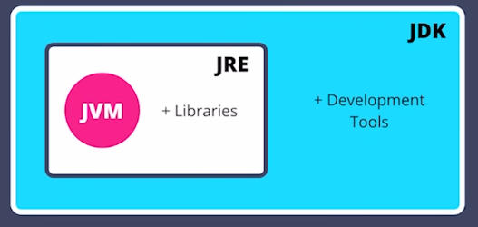

# Introduction to Java

## Syntax for Running Java Code
```java
class FirstClass {
    public static void main(String args[]) {
        system.out.println("Hello World");
    }
}
```
## How Does Java Code Run?
There are 2 stages to run Java code
1. Compilation 
2. Execution


- Source code is written in `.java` extension
- JRE: Java Runtime Environment
- JVM: Java Virtual Machine
- The source code is compiled using the compiler
- The compiler is inside JDK
- Which converts the source code to Byte code which has extension `.class`
- The byte code can run on any OS as long as that OS has `JRE`.
- Because of this java is also called a portable language - can run byte code on any system
- `JVM` converts byte code and converts it into native code (machine can understand this)



## Functions vs Classes
### Functions
```java
void main() {

}
```

### Classes
```java
class main
```
