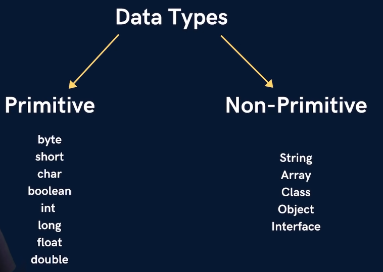
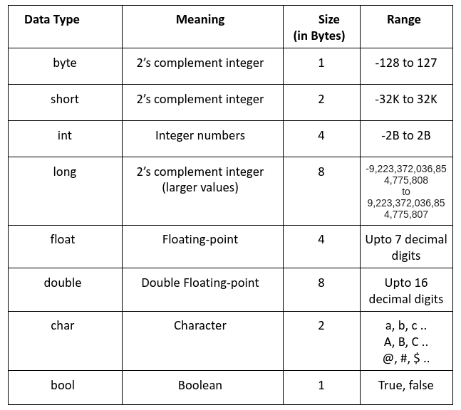

# Lecture 2
## Variables in Java | Input Output 

- `;` is used to indicate the command is finished - cumpolsary
- `System.out.print("Hello world")` is used to print output. `'` quotes will also work.
- Variable is something whose value is not fixed.

### Defining a variable
- We define a variable by specifying data type first. For e.g. `int a = 25`
- Each data type has a different size, hence uses more memory in RAM.
<center>

</center>

- Java is a typed language, i.e. have to define type of variable when declaring it - so that it can get desired size in memory.
- Python and Javascript are weakly typed languages.

### Non-Primitive Data types
- We can customize non-primitive datatypes - can customize based on our needs. 
- 1 byte = 8 bits (0/1 is 1 bit)
- 32 bit systems do smaller memory allocation

<center>

</center>

## User input
- In order to read data from the keyboard, Java has a `Scanner` class.
- `System.in` reads from the keyboard.
- Scanner class has a lot of methods to read
- `int a = sc.nextInt();` waits for the user to enter an integer. When the user types a number and presses Enter, that number is read and stored in the variable a.

```java
import java.util.Scanner;

public class main {
    public static void main(String[] args) {
        System.out.println("Taking input from the user");
        Scanner sc = new Scanner(System.in); // making a new object using scanner class (new instance)

        System.out.println("Enter number 1");
        int a = sc.nextInt();
        // System.out.println("You entered " + a);

        System.out.println("Enter number 2");
        int b = sc.nextInt();

        System.out.println("Sum is " + (a + b));

        System.out.println("Enter your name");
        String name = sc.next();
        System.out.println("Hello " + name);

    }
}
```