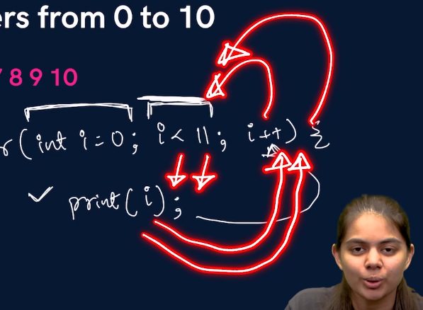

# 4. Loops in Java

1. for loop
2. while loop
3. do while loop

## For loop
- initialization is for initializing a variable which will be used for tracking in the loop
- updation is for updating the variable which was initialized.
- condition means till when is the loop valid - without this infinite loop.

```java
for (<initialization>, <condition>, <updation>) {
    //do something
}
```
Example:

```java
public class forloop {
    public static void main(String args[]) {
        for (int i = 0; i<5; i++) {
            System.out.println("Hello World");
            }}}
```


## While Loop

```java
while (<condition>) {
    // do something
}
```

## do while loop
pehle kaam krein g phir condition check kreinge
- chahe condition true ho ya false, kaam atleast 1 baar zaroor ho raha hoga
```java
do {

} while(condition);
```
18:30 done